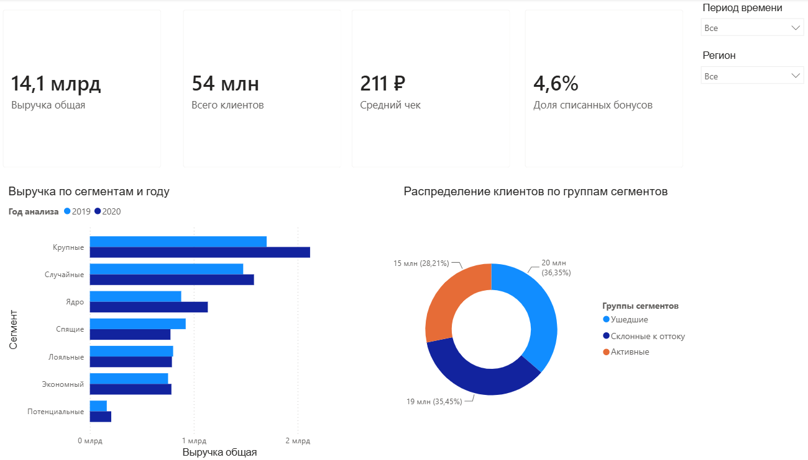

# Аналитика клиентской базы и программы лояльности в нетопливном ритейле (Power BI)

Сквозной аналитический проект по исследованию поведения клиентов, оценке эффективности программы лояльности и измерению динамики выручки в нетопливном ритейле (сеть АЗС). Проект включает аналитический отчет и интерактивный дашборд в Power BI.

---

## Описание проекта

Цель проекта — провести анализ клиентских метрик в динамике YoY (2019 vs 2020 гг.), оценить сегментацию клиентской базы (RFM / поведенческие паттерны) и определить ключевые драйверы роста выручки.

При нулевом приросте общего объема клиентской базы (~27 млн уникальных клиентов ежегодно) выручка вырастила на **10,4%** (достигнув 7,4 млрд руб.). В рамках проекта исследованы механизмы этого роста, выявлены стагнирующие сегменты и сформированы точечные стратегии удержания.

---

## Ключевые метрики и показатели

- **Совокупная выручка (анализируемый период):** 14,1 млрд руб. (*7,4 млрд руб. в 2020 г. против 6,7 млрд руб. в 2019 г.*)
- **Общий охват клиентской базы:** ~54 млн взаимодействий (~27 млн активных пользователей в год)
- **Средний чек (AOV):** Вырос на **+7,8%** (с 203 ₽ до 219 ₽, взвешенный средний чек ~211 ₽)
- **Доля списания бонусов:** Увеличилась в 3 раза (с **2,2%** в 2019 г. до **6,7%** в 2020 г., средняя за период — **4,6%**)
- **Динамика статусов клиентов:**
  - **Активные:** **29,8%** (*+3,2% YoY*)
  - **В зоне риска:** **34,1%** (*-2,6% YoY*)
  - **Ушедшие:** **36,35%** (*без существенных изменений*)

---

## Ключевые аналитические выводы

1. **Рост за счет программы лояльности:** Увеличение выручки произошло преимущественно за счет роста частоты покупок и размера чека в топовых сегментах, стимулированного 3-кратным ростом объема списания бонусов.
2. **Поляризация сегментов:** В то время как высокодоходные сегменты позитивно отреагировали на промо-механики, средне- и низкодоходные сегменты продемонстрировали стагнацию или негативную динамику YoY.
3. **Маржинальные риски:** Резкое увеличение доли списания бонусов (до 6,7%) требует строгого контроля ROI программы лояльности во избежание размытия маржинальности нетопливных товаров.

---

## Стратегический план и рекомендации

- **Топовые сегменты:** Поддержание текущих стимулирующих кампаний, внедрение VIP-уровней лояльности и персональных предложений для предотвращения выгорания базы.
- **Средние и спавшие сегменты:** Запуск триггерных кампаний с акцентом на высокомаржинальные маркерные товары (кофе, свежая выпечка) и использование механики сгорающих бонусов для стимуляции частоты визитов.
- **Оттекшие клиенты:** Проведение пилотной кампании по возврату (реативационные приветственные бонусы на нетопливные категории) для сегмента с высоким прошлым чеком.
- **Финансовый контроль:** Проведение анализа чувствительности маржи и регулярный расчет ROI промо-кампаний для балансировки затрат на бонусы и чистой прибыли.

---

## Инструменты и технологии

- **Power BI Desktop:** Разработка интерактивного дашборда, иерархических срезов, построение модели данных.
- **DAX:** Написание пользовательских расчетных мер, вычисление YoY-динамики, распределения статусов и средних чеков.
- **Excel / Data Modeling:** Очистка, первичная подготовка и консолидация данных.

---

## Предпросмотр дашборда

Интерактивный дашборд Power BI обеспечивает детальный обзор бизнес-KPI, сравнение сегментов в динамике YoY и структуру статусов клиентской базы:

